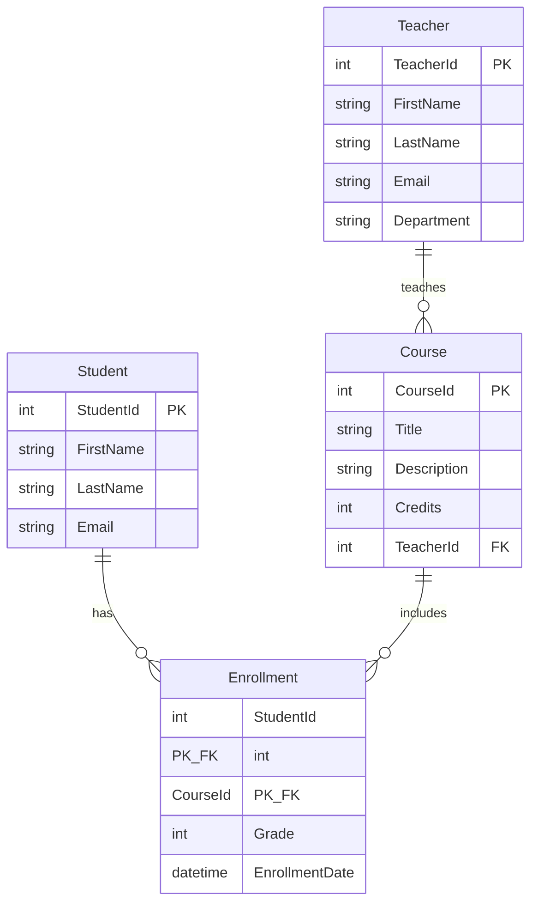

# AcademyLMS

AcademyLMS is a Learning Management System (LMS) built for academic institutions. It provides a RESTful Web API for managing core academic data—students, courses, teachers, and enrollments—using a clean **N-tier architecture** with strict separation of concerns, fully asynchronous data access, and DTO-based communication with clients.

---

## Table of Contents

- [Features](#features)
- [Technology Stack](#technology-stack)
- [Solution Structure](#solution-structure)
- [Architecture Overview](#architecture-overview)
- [Database Entities & Relationships](#database-entities--relationships)
- [Prerequisites](#prerequisites)
- [Installation & Setup](#installation--setup)
- [Running the Application](#running-the-application)
- [API Endpoints](#api-endpoints)
- [Configuration](#configuration)

---

## Features

- Full **CRUD** operations for **Students** and **Courses**
- **Entity Framework Core** with SQL Server LocalDB
- **Repository pattern** with async/await throughout the data layer
- **DTOs** and **AutoMapper** to prevent exposing database entities to clients
- **Data Annotations** validation on create requests
- **Global exception-handling middleware** with structured JSON error responses
- Layered design ready for extension (teachers, enrollments, authentication, etc.)

---

## Technology Stack

| Component | Technology |
|-----------|------------|
| Runtime | .NET 10 |
| Web API | ASP.NET Core |
| ORM | Entity Framework Core 10 |
| Database | SQL Server LocalDB |
| Mapping | AutoMapper 16 |
| API Documentation | OpenAPI (Development) |

---

## Solution Structure

```
AcademyLMS/
├── AcademyLMS.API/              # Presentation layer (controllers, middleware)
├── AcademyLMS.BusinessLogic/    # Business layer (services, DTOs, mapping)
├── AcademyLMS.DataAccess/       # Data layer (DbContext, entities, repositories)
├── DB/                          # LocalDB database files (.mdf / .ldf)
└── AcademyLMS.slnx              # Solution file
```

---

## Architecture Overview

The solution follows a **3-layer N-tier architecture**. Each layer has a single responsibility and depends only on the layers below it.

```
┌─────────────────────────────────────────────────────────┐
│                   AcademyLMS.API                        │
│  Controllers · Middleware · DI Registration             │
│  Accepts/returns DTOs only                                │
└──────────────────────────┬──────────────────────────────┘
                           │
┌──────────────────────────▼──────────────────────────────┐
│              AcademyLMS.BusinessLogic                     │
│  Services · DTOs · AutoMapper Profiles                    │
│  Business rules · Entity ↔ DTO mapping                    │
└──────────────────────────┬──────────────────────────────┘
                           │
┌──────────────────────────▼──────────────────────────────┐
│               AcademyLMS.DataAccess                     │
│  AcademyDbContext · Entities · Repositories             │
│  EF Core · Database persistence                         │
└─────────────────────────────────────────────────────────┘
```

### 1. API Layer (`AcademyLMS.API`)

The entry point for HTTP clients. Responsibilities include:

- REST controllers (`StudentsController`, `CoursesController`)
- Request validation and HTTP status codes (200, 201, 400, 404, 500)
- Dependency injection wiring (`Program.cs`)
- Global exception-handling middleware

This layer **never** exposes EF Core entities. It communicates exclusively through DTOs via the business layer.

### 2. Business Logic Layer (`AcademyLMS.BusinessLogic`)

The intermediary between the API and the database. Responsibilities include:

- Service interfaces and implementations (`IStudentService`, `ICourseService`)
- Data Transfer Objects (`StudentDto`, `CourseCreateDto`, etc.)
- AutoMapper profiles for entity ↔ DTO conversion
- Input validation attributes on create DTOs

Services inject repository interfaces and `IMapper`, keeping persistence details out of the API.

### 3. Data Access Layer (`AcademyLMS.DataAccess`)

Responsible for all database interaction. Responsibilities include:

- `AcademyDbContext` with Fluent API relationship configuration
- Entity classes (`Student`, `Course`, `Teacher`, `Enrollment`)
- Repository interfaces and async implementations
- EF Core queries using async methods only (`ToListAsync`, `FindAsync`, `SaveChangesAsync`, etc.)

---

## Database Entities & Relationships

The data model supports teachers delivering courses and students enrolling in them.



| Entity | Description |
|--------|-------------|
| **Teacher** | An instructor who teaches one or more courses. |
| **Course** | An academic course assigned to a single teacher. |
| **Student** | A learner who can enroll in multiple courses. |
| **Enrollment** | Join entity linking a student to a course, storing **Grade** and **EnrollmentDate**. |

### Relationships

| Relationship | Type | Description |
|--------------|------|-------------|
| Teacher → Course | **One-to-Many** | One teacher can teach many courses; each course belongs to one teacher. |
| Student ↔ Course | **Many-to-Many** | Implemented through the **Enrollment** join entity, which also stores grade and enrollment date. |

The composite primary key on `Enrollment` (`StudentId`, `CourseId`) is configured in `AcademyDbContext.OnModelCreating` using the Fluent API.

---

## Prerequisites

Before running the project, ensure the following are installed:

- [.NET 10 SDK](https://dotnet.microsoft.com/download)
- [SQL Server LocalDB](https://learn.microsoft.com/sql/database-engine/configure-windows/sql-server-express-localdb) (included with Visual Studio or SQL Server Express)
- *(Optional)* [Visual Studio 2022](https://visualstudio.microsoft.com/) or [VS Code](https://code.visualstudio.com/)

Verify your installation:

```bash
dotnet --version
```

---

## Installation & Setup

### 1. Clone the repository

```bash
git clone <repository-url>
cd AcademyLMS
```

### 2. Restore NuGet packages

```bash
dotnet restore
```

### 3. Configure the database connection

The connection string is defined in `AcademyLMS.API/appsettings.json` and points to a LocalDB file in the solution's `DB/` folder:

```json
"ConnectionStrings": {
  "AcademyDb": "Server=(localdb)\\mssqllocaldb;AttachDbFilename=../DB/AcademyLMS.mdf;Database=AcademyLMS;Trusted_Connection=True;MultipleActiveResultSets=true;TrustServerCertificate=true"
}
```

No credentials are hard-coded in source files. Adjust the path in `appsettings.json` if your folder layout differs.

### 4. Create the database

Install the EF Core tools (once per machine):

```bash
dotnet tool install --global dotnet-ef
```

From the solution root, create and apply the initial migration:

```bash
dotnet ef migrations add InitialCreate --project AcademyLMS.DataAccess --startup-project AcademyLMS.API
dotnet ef database update --project AcademyLMS.DataAccess --startup-project AcademyLMS.API
```

This creates `AcademyLMS.mdf` inside the `DB/` directory.

### 5. Build the solution

```bash
dotnet build
```

---

## Running the Application

Start the API from the solution root:

```bash
dotnet run --project AcademyLMS.API
```

Default URLs (see `Properties/launchSettings.json`):

| Profile | URL |
|---------|-----|
| HTTP | `http://localhost:5161` |
| HTTPS | `https://localhost:7220` |

In **Development**, OpenAPI metadata is available at:

```
http://localhost:5161/openapi/v1.json
```

---

## API Endpoints

### Students — `api/students`

| Method | Route | Description |
|--------|-------|-------------|
| `GET` | `/api/students` | Get all students (optional `?email=` filter) |
| `GET` | `/api/students/{id}` | Get a student by ID |
| `POST` | `/api/students` | Create a new student |
| `PUT` | `/api/students/{id}` | Update an existing student |
| `DELETE` | `/api/students/{id}` | Delete a student |

**Create request example:**

```json
{
  "firstName": "Jane",
  "lastName": "Doe",
  "email": "jane.doe@academy.edu"
}
```

### Courses — `api/courses`

| Method | Route | Description |
|--------|-------|-------------|
| `GET` | `/api/courses` | Get all courses (optional `?teacherId=` filter) |
| `GET` | `/api/courses/{id}` | Get a course by ID |
| `POST` | `/api/courses` | Create a new course |
| `PUT` | `/api/courses/{id}` | Update an existing course |
| `DELETE` | `/api/courses/{id}` | Delete a course |

**Create request example:**

```json
{
  "title": "Introduction to Computer Science",
  "description": "Foundational programming and algorithms course.",
  "credits": 3,
  "teacherId": 1
}
```

### HTTP Status Codes

| Code | Meaning |
|------|---------|
| `200 OK` | Successful GET, PUT, or DELETE |
| `201 Created` | Resource successfully created |
| `400 Bad Request` | Validation failure or invalid input |
| `404 Not Found` | Resource does not exist |
| `500 Internal Server Error` | Unhandled server error (logged; safe JSON returned to client) |

---

## Configuration

| Setting | Location | Purpose |
|---------|----------|---------|
| Connection string | `AcademyLMS.API/appsettings.json` | LocalDB file path and server |
| Development overrides | `AcademyLMS.API/appsettings.Development.json` | Environment-specific settings |
| Launch URLs | `AcademyLMS.API/Properties/launchSettings.json` | Local development ports |

Database files (`.mdf`, `.ldf`) in the `DB/` folder are excluded from source control via `.gitignore`.

---

## License

---
dotnet clean

dotnet build

dotnet ef database update --project AcademyLMS.DataAccess --startup-project AcademyLMS.API

dotnet run --project AcademyLMS.API

---
