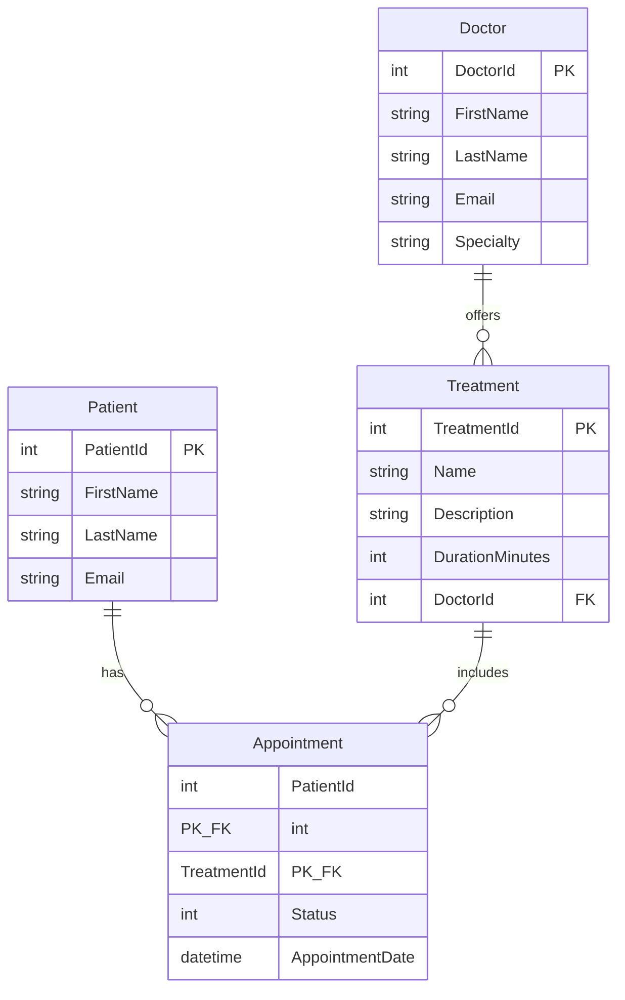

# ClinicFlow

ClinicFlow is a clinic management REST API for managing patients, doctors, treatments, and appointments. It uses a clean **N-tier architecture** with strict separation of concerns, fully asynchronous data access, and DTO-based communication with clients.

---

## Table of Contents

- [Features](#features)
- [Technology Stack](#technology-stack)
- [Solution Structure](#solution-structure)
- [Architecture Overview](#architecture-overview)
- [Database Entities & Relationships](#database-entities--relationships)
- [Prerequisites](#prerequisites)
- [Installation & Setup](#installation--setup)
- [Running the Application](#running-the-application)
- [API Documentation (Swagger)](#api-documentation-swagger)
- [API Endpoints](#api-endpoints)
- [Configuration](#configuration)

---

## Features

- Full **CRUD** operations for all four core entities: **Patients**, **Doctors**, **Treatments**, and **Appointments**
- **Entity Framework Core** with SQL Server LocalDB
- **Repository pattern** with async/await throughout the data layer
- **DTOs** and **AutoMapper** to prevent exposing database entities to clients
- **Data Annotations** validation on create and update requests
- **Global exception-handling middleware** with structured JSON error responses
- **Interactive Swagger UI** for exploring and testing the API in Development
- Layered design ready for extension (authentication, authorization, etc.)

---

## Technology Stack

| Component | Technology |
|-----------|------------|
| Runtime | .NET 10 |
| Web API | ASP.NET Core |
| ORM | Entity Framework Core 10 |
| Database | SQL Server LocalDB |
| Mapping | AutoMapper 16 |
| OpenAPI | `Microsoft.AspNetCore.OpenApi` |
| API UI | `Swashbuckle.AspNetCore.SwaggerUI` (Development) |

---

## Solution Structure

```
ClinicFlow/
├── ClinicFlow.API/              # Presentation layer (controllers, middleware)
├── ClinicFlow.BusinessLogic/    # Business layer (services, DTOs, mapping)
├── ClinicFlow.DataAccess/       # Data layer (DbContext, entities, repositories)
├── DB/                          # LocalDB database files (.mdf / .ldf)
└── ClinicFlow.slnx              # Solution file
```

---

## Architecture Overview

The solution follows a **3-layer N-tier architecture**. Each layer has a single responsibility and depends only on the layers below it.

```
┌─────────────────────────────────────────────────────────┐
│                   ClinicFlow.API                        │
│  Controllers · Middleware · DI Registration             │
│  Accepts/returns DTOs only                                │
└──────────────────────────┬──────────────────────────────┘
                           │
┌──────────────────────────▼──────────────────────────────┐
│              ClinicFlow.BusinessLogic                     │
│  Services · DTOs · AutoMapper Profiles                    │
│  Business rules · Entity ↔ DTO mapping                    │
└──────────────────────────┬──────────────────────────────┘
                           │
┌──────────────────────────▼──────────────────────────────┐
│               ClinicFlow.DataAccess                     │
│  ClinicFlowDbContext · Entities · Repositories             │
│  EF Core · Database persistence                         │
└─────────────────────────────────────────────────────────┘
```

### 1. API Layer (`ClinicFlow.API`)

The entry point for HTTP clients. Responsibilities include:

- REST controllers (`PatientsController`, `DoctorsController`, `TreatmentsController`, `AppointmentsController`)
- Request validation and HTTP status codes (200, 201, 400, 404, 500)
- Dependency injection wiring (`Program.cs`)
- Global exception-handling middleware
- Swagger UI (Development only)

This layer **never** exposes EF Core entities. It communicates exclusively through DTOs via the business layer.

### 2. Business Logic Layer (`ClinicFlow.BusinessLogic`)

The intermediary between the API and the database. Responsibilities include:

- Service interfaces and implementations for all four entities
- Data Transfer Objects (`PatientDto`, `DoctorCreateDto`, `TreatmentDto`, `AppointmentDto`, etc.)
- AutoMapper profiles for bidirectional entity ↔ DTO conversion
- Input validation attributes on DTOs

Services inject repository interfaces and `IMapper`, keeping persistence details out of the API.

### 3. Data Access Layer (`ClinicFlow.DataAccess`)

Responsible for all database interaction. Responsibilities include:

- `ClinicFlowDbContext` with Fluent API relationship configuration
- Entity classes (`Patient`, `Doctor`, `Treatment`, `Appointment`)
- Repository interfaces and async implementations for all four entities
- EF Core queries using async methods only (`ToListAsync`, `FindAsync`, `SaveChangesAsync`, etc.)

---

## Database Entities & Relationships

The data model supports doctors offering treatments and patients booking appointments.



| Entity | Description |
|--------|-------------|
| **Doctor** | A physician who offers one or more treatments. |
| **Treatment** | A medical treatment assigned to a single doctor. |
| **Patient** | A patient who can book multiple treatments. |
| **Appointment** | Join entity linking a patient to a treatment, storing **Status** and **AppointmentDate**. |

### Appointment Status Values

| Value | Meaning |
|-------|---------|
| `0` | Scheduled |
| `1` | Completed |
| `2` | Cancelled |
| `3` | No-show |

### Relationships

| Relationship | Type | Description |
|--------------|------|-------------|
| Doctor → Treatment | **One-to-Many** | One doctor can offer many treatments; each treatment belongs to one doctor. |
| Patient ↔ Treatment | **Many-to-Many** | Implemented through the **Appointment** join entity, which also stores status and appointment date. |

The composite primary key on `Appointment` (`PatientId`, `TreatmentId`) is configured in `ClinicFlowDbContext.OnModelCreating` using the Fluent API.

---

## Prerequisites

Before running the project, ensure the following are installed:

- [.NET 10 SDK](https://dotnet.microsoft.com/download)
- [SQL Server LocalDB](https://learn.microsoft.com/sql/database-engine/configure-windows/sql-server-express-localdb) (included with Visual Studio or SQL Server Express)
- *(Optional)* [Visual Studio 2022](https://visualstudio.microsoft.com/) or [VS Code](https://code.visualstudio.com/)

Verify your installation:

```bash
dotnet --version
```

---

## Installation & Setup

### 1. Clone the repository

```bash
git clone <repository-url>
cd ClinicFlow
```

### 2. Restore NuGet packages

```bash
dotnet restore ClinicFlow.API
```

### 3. Configure the database connection

The connection string is defined in `ClinicFlow.API/appsettings.json` and points to a LocalDB file in the solution's `DB/` folder:

```json
"ConnectionStrings": {
  "ClinicFlowDb": "Server=(localdb)\\mssqllocaldb;Database=ClinicFlow;Trusted_Connection=True;MultipleActiveResultSets=true;TrustServerCertificate=true"
}
```

No credentials are hard-coded in source files. Adjust the path in `appsettings.json` if your folder layout differs.

### 4. Create the database

Install the EF Core tools (once per machine):

```bash
dotnet tool install --global dotnet-ef
```

From the solution root, create and apply the initial migration:

```bash
dotnet ef migrations add InitialCreate --project ClinicFlow.DataAccess --startup-project ClinicFlow.API
dotnet ef database update --project ClinicFlow.DataAccess --startup-project ClinicFlow.API
```

This creates `ClinicFlow.mdf` inside the `DB/` directory.

### 5. Build the project

```bash
dotnet build ClinicFlow.API
```

---

## Running the Application

Start the API from the solution root:

```bash
dotnet run --project ClinicFlow.API
```

Default URLs (see `Properties/launchSettings.json`):

| Profile | URL |
|---------|-----|
| HTTP | `http://localhost:5161` |
| HTTPS | `https://localhost:7220` |

The browser opens automatically to Swagger UI in Development.

---

## API Documentation (Swagger)

In **Development**, the API exposes:

| Resource | URL |
|----------|-----|
| **Swagger UI** | `http://localhost:5161/swagger` |
| **OpenAPI JSON** | `http://localhost:5161/openapi/v1.json` |

Swagger UI is powered by the built-in `Microsoft.AspNetCore.OpenApi` document generator and `Swashbuckle.AspNetCore.SwaggerUI`. Both are registered only when `ASPNETCORE_ENVIRONMENT=Development`.

Use Swagger to explore all four controllers, inspect request/response schemas, and execute API calls directly from the browser.

---

## API Endpoints

### Patients — `api/patients`

| Method | Route | Description |
|--------|-------|-------------|
| `GET` | `/api/patients` | Get all patients (optional `?email=` filter) |
| `GET` | `/api/patients/{id}` | Get a patient by ID |
| `POST` | `/api/patients` | Create a new patient |
| `PUT` | `/api/patients/{id}` | Update an existing patient |
| `DELETE` | `/api/patients/{id}` | Delete a patient |

**Create request example:**

```json
{
  "firstName": "Jane",
  "lastName": "Doe",
  "email": "jane.doe@clinic.com"
}
```

### Doctors — `api/doctors`

| Method | Route | Description |
|--------|-------|-------------|
| `GET` | `/api/doctors` | Get all doctors (optional `?specialty=` filter) |
| `GET` | `/api/doctors/{id}` | Get a doctor by ID |
| `POST` | `/api/doctors` | Create a new doctor |
| `PUT` | `/api/doctors/{id}` | Update an existing doctor |
| `DELETE` | `/api/doctors/{id}` | Delete a doctor |

**Create request example:**

```json
{
  "firstName": "David",
  "lastName": "Cohen",
  "email": "david.cohen@clinic.com",
  "specialty": "Cardiology"
}
```

### Treatments — `api/treatments`

| Method | Route | Description |
|--------|-------|-------------|
| `GET` | `/api/treatments` | Get all treatments (optional `?doctorId=` filter) |
| `GET` | `/api/treatments/{id}` | Get a treatment by ID |
| `POST` | `/api/treatments` | Create a new treatment |
| `PUT` | `/api/treatments/{id}` | Update an existing treatment |
| `DELETE` | `/api/treatments/{id}` | Delete a treatment |

**Create request example:**

```json
{
  "name": "General Checkup",
  "description": "Routine health examination.",
  "durationMinutes": 30,
  "doctorId": 1
}
```

### Appointments — `api/appointments`

Appointments use a **composite key** (`PatientId` + `TreatmentId`) to link patients to treatments.

| Method | Route | Description |
|--------|-------|-------------|
| `GET` | `/api/appointments` | Get all appointments (optional `?patientId=` / `?treatmentId=` filters) |
| `GET` | `/api/appointments/{patientId}/{treatmentId}` | Get a specific appointment |
| `POST` | `/api/appointments` | Book a patient for a treatment |
| `PUT` | `/api/appointments/{patientId}/{treatmentId}` | Update status or appointment date |
| `DELETE` | `/api/appointments/{patientId}/{treatmentId}` | Cancel an appointment |

**Create request example:**

```json
{
  "patientId": 1,
  "treatmentId": 2,
  "status": 0,
  "appointmentDate": "2026-01-15T09:00:00Z"
}
```

### HTTP Status Codes

| Code | Meaning |
|------|---------|
| `200 OK` | Successful GET, PUT, or DELETE |
| `201 Created` | Resource successfully created |
| `400 Bad Request` | Validation failure or invalid input |
| `404 Not Found` | Resource does not exist |
| `409 Conflict` | Duplicate appointment (patient already booked for treatment) |
| `500 Internal Server Error` | Unhandled server error (logged; safe JSON returned to client) |

---

## Configuration

| Setting | Location | Purpose |
|---------|----------|---------|
| Connection string | `ClinicFlow.API/appsettings.json` | LocalDB file path and server |
| Development overrides | `ClinicFlow.API/appsettings.Development.json` | Environment-specific settings |
| Launch URLs | `ClinicFlow.API/Properties/launchSettings.json` | Local development ports and Swagger launch URL |

Database files (`.mdf`, `.ldf`) in the `DB/` folder are excluded from source control via `.gitignore`.

---

## Quick Start (TL;DR)

```bash
dotnet restore ClinicFlow.API
dotnet build ClinicFlow.API
dotnet ef database update --project ClinicFlow.DataAccess --startup-project ClinicFlow.API
dotnet run --project ClinicFlow.API
```

Then open **http://localhost:5161/swagger** to explore the API.
